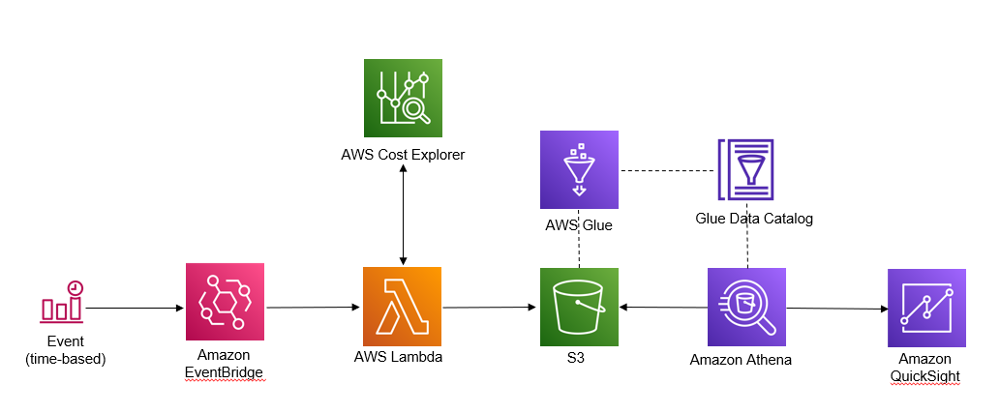

## Cost Forecasting in a Multi-Account Organization

This solution enables users to get cost forecast data from a multi-account organization, and visualize it in a single pane of glass, in AWS QuickSight, MS Excel, or any compatible 3rd party BI tool. 

Using the Cost Explorer console to get cost forecasting data across all accounts, and their corresponding regions, in a multi-account organization, is a cumbersome and error prone process. For a multi-account organization, users do not have the ability to get cost forecasts data from Cost Explorer, in a single query, and “group by” any attribute, such as, accounts, regions, forecast month, etc. 

Once deployed, this solution automatically collects all cost forecasting data at a predefined schedule (daily/weekly) from cost explorer, transforms the output to be easily queried or “grouped by” in Athena, visualized in QuickSight or any compatible 3rd party BI tool, or very simply visualized as clustered, stacked charts in MS Excel. 

## Solution Architecture

## How it works

1.	An EventBridge rule is configured to invoke a Lambda function at a pre-configured schedule. For example, daily, weekly or monthly. Defaults to 7 days.
2.	EventBridge invokes the Lambda function and passes the desired forecast months, and the target S3 location for storing cost forecast results as arguments to the Lambda function. The JSON input to the Lambda function looks something like this,              
   	{  
         "S3Bucket": "mybucket", 
         "S3FolderPath": "CostExplorerForecast/",  
         "ForecastMonths": 6  
      } 
3.	The Lambda function does the following,
    -	Gets the list of accounts from AWS Organization. 
    -	Get a list of active regions within each account from EC2.
    -	Gets cost forecast data from Cost Explorer, for each active region within the account.
    - Filters accounts and/or regions with no historical cost. 
    - Extracts relevant fields from the output from Cost Explorer, transforms and outputs the results as a CSV file in S3. This file can now be consumed by Amazon  Quicksight, and other 3rd party BI tools, like Tableau or Power BI to be graphically visualized.  
    - Optionally, creates a transformation for MS Excel to be viewed as clustered, stacked charts.
4.	The schema for the forecast data is defined and stored in AWS Glue data catalog.
5.	Amazon Quicksight, or any 3rd Party BI tool such as Tableau or Power BI that is compatible with Athena can be used to query and visualize cost forecasting data across accounts and regions.
6.	To view the data in MS Excel, as clustered, stacked charts, uncomment a couple of lines of code in the Lambda function, to get the same forecast data, but transformed to be compatible with MS Excel charts.
For example, uncomment the following lines in the python code,
s3_key_excel = event['S3FolderPath'] + "Excel/ce_forcasts_excel.csv"
put_results_in_s3(s3_bucket, s3_key_excel, forecast_results) 

## Deploy the solution
The solution includes the following files

**GetCostExplorerForecasts.py**
Python script for the Lambda function.

**CloudFormation-CostExplorerForecasts.yml**
CloudFormation template to deploy the solution.

### Prerequisites
Create a new S3 bucket, or use an existing one to serve as the target location for all cost forecasting data. Keep the S3 bucket name handy to use when launching the CloudFormation script.

### Deploy using CloudFormation
Use the CloudFormation template CloudFormation-CostExplorerForecasts.yml to deploy the solution. 

Provide the following inputs as parameters to CloudFormation when prompted,

**S3BucketName:** Name of the S3 bucket to deliver Cost Explorer forecast results  
**S3FolderPath:** Enter the path to a folder within the S3 bucket for the results file  
     *Default: "CostExplorerForecast/"*  
**ScheduleExpression:** Interval for the scheduler to run, e.g. every 7 days, or an EventBridge cron job pattern  
     *Default:* "rate(7 days)"*  
**ForecastMonths:** Forecast Months e.g. 3,6,9,12  
     *Default: 6*  
**GlueDBName:**  Name of Glue database  
    *Default: "cost_explorer_forecasts"*  

The cloud formation script creates the Lambda function along with the necessary permissions for the Lambda role, creates a scheduler in Amazon EventBridge, creates the database and tables in AWS Glue Data Catalog. 

For easy reference to resources created in Glue, or S3, please see the “Outputs” section of the CloudFormation stack you created to deploy the solution. The following keys are created for reference,

**GlueDatabaseName:**  Name of the Glue Database  
**GlueTableName:**  Name of the Glue Table  
**S3URIForecastResultsQuickSight:**  S3 URI of forecast results for QuickSight  
**S3URIForecastResultsExcel:**  S3 URI of forecast results for Excel  

## Visualizing cost forecasting data 
To visualize your cost forecasting data, make sure the Lambda function is invoked at least once by EventBridge. To do a quick test, you may trigger the Lambda function manually from the AWS management console, or via CLI to make sure cost forecasting data is available in S3.  

### Amazon QuickSight
To use QuickSight for visualizing your data, you need to create a new dataset from the Athena table that was created after deploying the solution. For step-by-step instructions, see

Creating a dataset using Amazon Athena data
https://docs.aws.amazon.com/quicksight/latest/user/create-a-data-set-athena.html

### Amazon Athena

To use Athena to query the data, connect to the Glue database, and select the Glue table from the Athena console. The Glue database and table to use in Athena are listed in the Outputs section of the CloudFormation stack.

### MS Excel

To visualize forecasting data as clustered stacked charts in Excel, download the file from the S3 location referenced by the S3URIForecastResultsExcel key in the Outputs section of your CloudFormation stack.

To create clustered stacked charts in Excel, see
https://www.youtube.com/watch?v=ukgSW_Xhtes

## Contributions

See [CONTRIBUTING](CONTRIBUTING.md#security-issue-notifications) for more information.

## License

This library is licensed under the MIT-0 License. See the LICENSE file.

